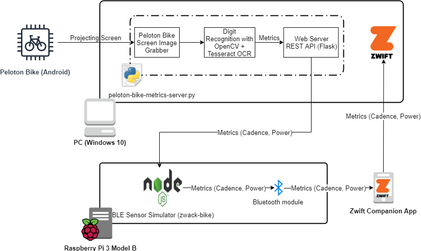
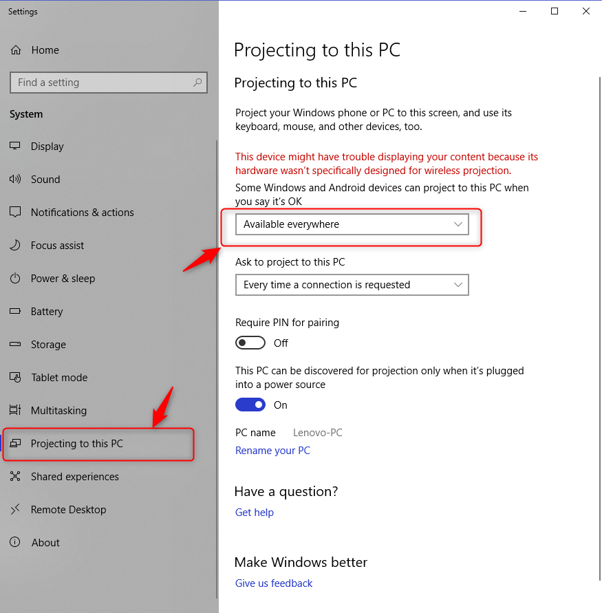
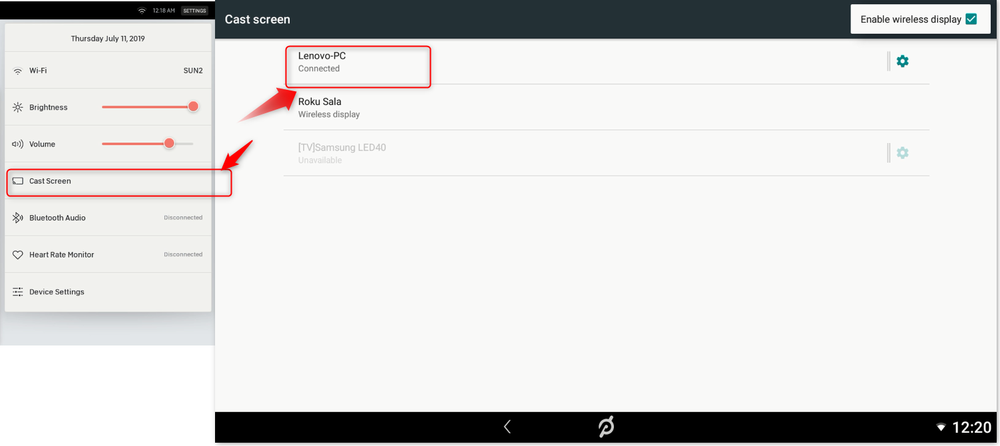
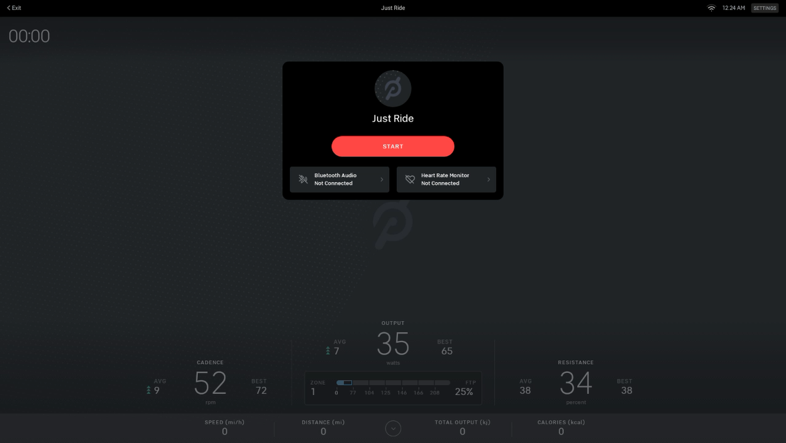

# peloton-bike-metrics-server

The code in this repository acquires Peloton® Bike metrics (such as cadence and output) by using Tesseract OCR to perform digit recognition on the projected screen from the Android table installed on the bike.  
Metrics are exposed at `/metrics` REST endpoint so they can be consumed by a wide range of applications.

As an example, the code in this project can be used to integrate with [zwack-bike](https://github.com/iaroslavn/zwack-bike) to allow Peloton® Bike owners to take rides on Zwift.  
Diagram of the project:  

# Requirements

  * Windows (tested on Windows 10 x64, Version 1803)
  * Python 3.x
  * Peloton® Bike that runs on Android

# Installation

  * Install Python 3.x
  * Install [Tesseract OCR](https://github.com/tesseract-ocr/tesseract) should be installed on the machine (tested on [Tesseract 4 for Win x64](https://digi.bib.uni-mannheim.de/tesseract/tesseract-ocr-w64-setup-v4.1.0-elag2019.exe))
  * Clone repository, create virtual environment and install python dependencies:

        git clone https://github.com/iaroslavn/peloton-bike-metrics-server.git
        cd peloton-bike-metrics-server

        virtualenv metrics-server-env
        metrics-server-env\Scripts\activate.bat
        
        pip install pillow
        pip install pytesseract
        pip install numpy
        pip install opencv-python
        pip install pywin32
        pip install flask-restful

# Running the Peloton Bike Metrics Server

  * Allow Peloton® Android device to project its screen to your Windows monitor:
  
  * On Peloton® Bike navigate to Settings > Cast Screen and connect to your PC:
  
  * Start a ride session on Peloton® Bike:
  
  * Start the Peloton Bike Metrics Server:

        cd peloton-bike-metrics-server

        metrics-server-env\Scripts\activate.bat

        set PATH=C:\Program Files\Tesseract-OCR\;%PATH%

        python metrics-server.py
  * Bring the Connect window to the front
  * Open http://127.0.0.1:5000/metrics in your browser and verify that metrics are being returned. E.g.:

        {"cadence": 85, "power": 102}
  * Check out the [zwack-bike](https://github.com/iaroslavn/zwack-bike) project if you want to consume these metrics by BLE device simulator and report them to an application such as Zwift.

# Debug Flags

Use `-d` or `--debug` flag to start the server in the debug mode:

    python metrics-server.py -d

Use `-p` or `--port` flag to change the default web server port:

    python metrics-server.py --port 5001

# Known limitations

* The Connect window with the projected Peloton® Bike screen have to be visible so the metric numbers can be recognized.
* Depending on your screen you might have to adjust rectangle coordinates in `get_power_and_cadence_imgs` function. Turn on the debug mode (`-d` flag) to see what's been recognized by the OCR process.

# Donations

If you like this project, please consider doing the following:
* Starring on GitHub
* [Buying me a coffee](https://www.buymeacoffee.com/iaroslav)

